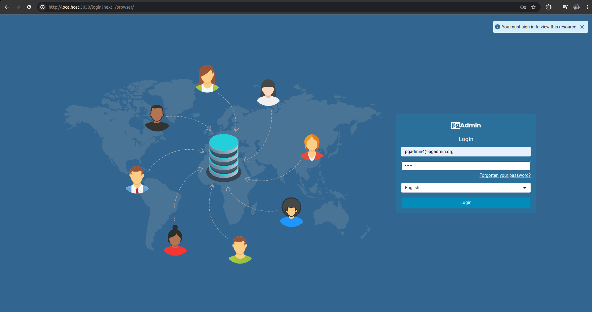
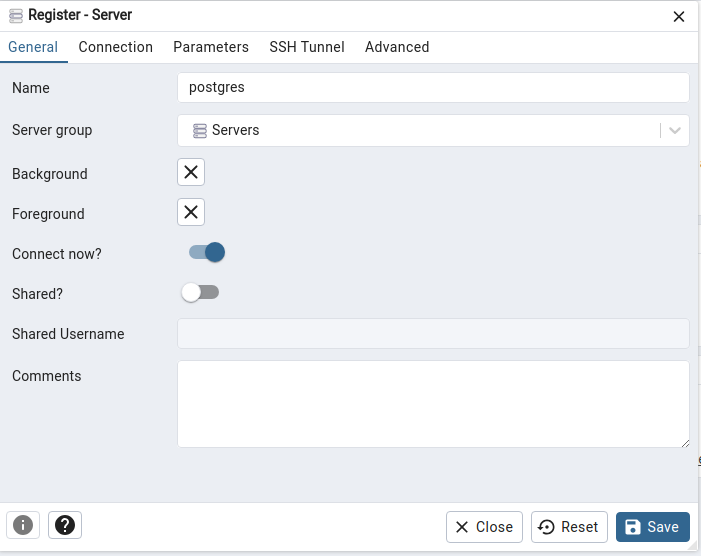
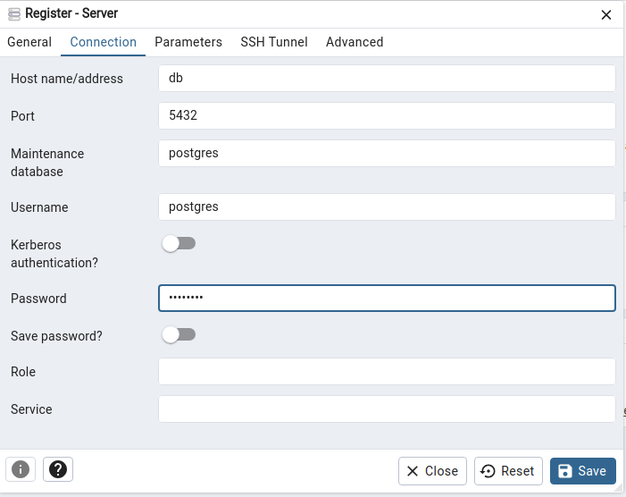

## Run and create Database
Make sure you already have [Docker](https://docs.docker.com/engine/install/), [Docker-compose](https://docs.docker.com/compose/install/)

### Copy all values in .env.example
```bash
cp .env.example .env
```
You can change all variables into your own values in .env file

### Run Postgres and Pgadmin4's Docker image

```bash
docker compose up -d --build
```

### Go to Pgadmin4 and connect to postgres server
You can go to [localhost:5050](https://localhost:5050) and login using `PGADMIN_DEFAULT_EMAIL`, `PGADMIN_DEFAULT_PASSWORD` where 5050 is `PGADMIN_PORT`



Then Create connection to postgresql
Click on "Add New Server" and fill "General" and "Connection" form




In connection form, HOSTNAME is name of postgres service in docker-compose.yml

USERNAME is `POSTGRES_USER`

PASSWORD is `POSTGRES_PASSWORD`

## Run server locally

Change `POSTGRES_HOST`=localhost

### Create virtual environment
```bash
python3 -m venv .venv && source .venv/bin/activate
cd server
```

### Install dependencies
```bash
pip install -r requirements.txt
```
### Run debug frontend
```bash
python manage.py tailwind install
python manage.py tailwind start
```
### Intial Data 

```bash
python manage.py shell
```
paste this to create

```bash
with open('my_script.py') as f:
    code = f.read()
    exec(code)
```


### Run server
```bash
python manage.py runserver 0.0.0.0:8000
```

## Run server via Docker
Change `POSTGRES_HOST`=db

```bash
docker compose up -d
```

Go to [localhost:8000/helloworld](http://localhost:8000/helloworld)
